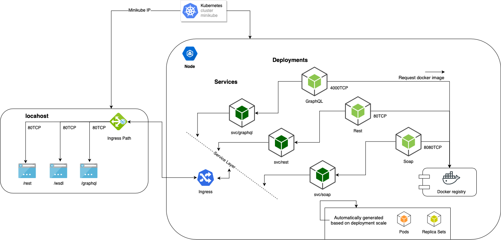

# PROJECT
Distributed load testing using kubernetes

## ARCHITECTURE



## USING

### Installing Prerequisites

See [Installing Minikube](https://kubernetes.io/docs/tasks/tools/install-minikube/)

```
$ minikube version
```

See [Installing kubectl](https://kubernetes.io/docs/tasks/tools/install-kubectl/)

```
$ kubectl version
```

### Create kubernetes cluster with minikube

```
$ minikube start
```

### Create Deployments

```
$ kubectl apply -f kubernetes/deployments/rest-deployment.yaml 
$ kubectl apply -f kubernetes/deployments/soap-deployment.yaml 
$ kubectl apply -f kubernetes/deployments/graphql-deployment.yaml
```

### Create Services

```
$ kubectl apply -f kubernetes/services/rest-service.yaml 
$ kubectl apply -f kubernetes/services/graphql-service.yaml  
$ kubectl apply -f kubernetes/services/soap-service.yaml 
```

### Create Ingress

```
$ kubectl apply -f kubernetes/ingress/app-ingress.yaml
$ kubectl describe ingress app-ingress
```

### Enable or Disable Ingress

```
$ minikube addons enable ingress
$ minikube addons disable ingress
```

### Accesss the service getting the minikube IP

```
$ minikube ip
```

* Open the browser on https://{minikube-ip-result}


